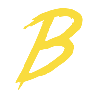
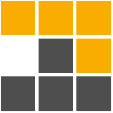
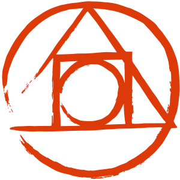
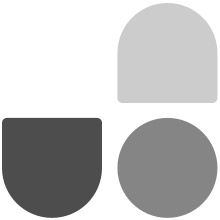
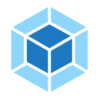

# Webstorm UI README

## Example:

## icon list:

### custom icons

|  #  |    name     |                                   dark                                   |                               light                                |
| :-: | :---------: | :----------------------------------------------------------------------: | :----------------------------------------------------------------: |
|  1  |  angularJS  |    |                                 -                                  |
|  2  |    babel    |        |                                 -                                  |
|  3  |    pnpm     |         |                                 -                                  |
|  4  |   postcss   |      |                                 -                                  |
|  5  |  protobuf   |     |                                 -                                  |
|  6  |   rollup    |       |                                 -                                  |
|  7  |    rust     |         |  |
|  8  |   svelte    |       |                                 -                                  |
|  9  | tailwindcss |  |                                 -                                  |
| 10  |   unocss    |       |                                 -                                  |
| 11  |    vite     |         |                                 -                                  |
| 12  |   vitest    |       |                                 -                                  |
| 13  |   vscode    |       |                                 -                                  |
| 14  |   webpack   |      |                                 -                                  |
| 25  |    vueJs    |        |                                 -                                  |

### jetBrains icons

|  #  |        name        |                                     dark                                      |                                     light                                      |
| :-: | :----------------: | :---------------------------------------------------------------------------: | :----------------------------------------------------------------------------: |
|  1  |    actionScript    |        |        |
|  2  |       addAny       |              |              |
|  3  |      anyType       |             |             |
|  4  |      archive       |             |             |
|  5  |        asm         |                 |                 |
|  6  |         c          |                   |                   |
|  7  |       config       |              |              |
|  8  |        cpp         |                 |                 |
|  9  |        css         |                 |                 |
| 10  |        csv         |                 |                 |
| 11  |    editorConfig    |        |        |
| 12  |       eslint       |              |              |
| 13  | folder_node_module |  |  |
| 14  |    folder_open     |         |         |
| 15  |       folder       |              |              |
| 16  |        font        |                |                |
| 17  |     gitignore      |           |                                       -                                        |
| 18  |         go         |                  |                  |
| 19  |        html        |                |                |
| 20  |      ignored       |             |             |
| 21  |       image        |               |               |
| 22  |        java        |                |                |
| 23  |     javaScript     |          |          |
| 24  |        jest        |                |                                       -                                        |
| 25  |      js_hint       |             |             |
| 26  |      js_test       |             |             |
| 27  |        json        |                |                |
| 28  |        jsp         |                 |                 |
| 29  |        jspx        |                |                |
| 30  |      jsx_test      |            |            |
| 31  |       kotlin       |              |              |
| 32  |        less        |                |                |
| 33  |       lombok       |              |              |
| 34  |    lombokConfig    |        |        |
| 35  |      manifest      |            |            |
| 36  |      markdown      |            |            |
| 37  |       patch        |               |               |
| 38  |        php         |                 |                 |
| 39  |     properties     |          |          |
| 40  |       react        |               |               |
| 41  |        sass        |                |                |
| 42  |       shell        |               |               |
| 43  |     sourceMap      |           |           |
| 44  |        sql         |                 |                 |
| 45  |     stylelint      |           |           |
| 46  |       stylus       |              |              |
| 47  |       table        |               |               |
| 48  |        text        |                |                |
| 49  |      ts_test       |             |             |
| 50  |      tsx_test      |            |            |
| 51  |     typescript     |          |          |
| 52  |      unknown       |             |             |
| 53  |       xhtml        |               |               |
| 54  |        xml         |                 |                 |
| 55  |        yaml        |                |                |
| 56  |        yarn        |                |                                       -                                        |
